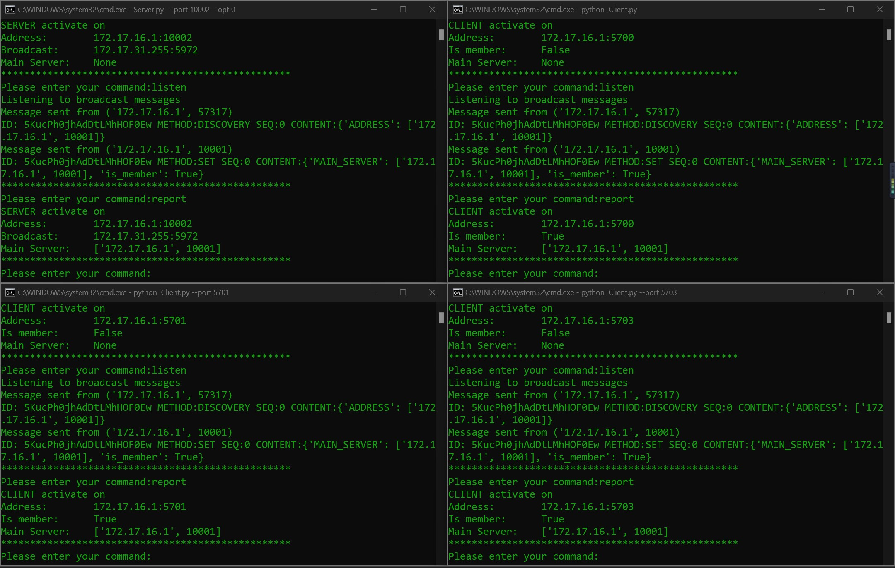

# ds_project_ws2223
Group members: Sena Tarpan, Peter Hoesch, Yun Ye <br>

### Introduction

Our goal in this project is to build a fully functioning, distributed system for Auction.The system will be implemented as a many servers-many clients design. The servers are the seller who functions as the main server as well as supplemental servers that provide fault tolerance and scalability. The clients on the other hand works like a thin client machine that provide merely an interface with a very restricted logic and data functionality. The supplemental servers exist to take bids, aggregate them and transfer that data to the main server. For this purpose, each server will be connected to a number of clients. The clients only communicate with this server, not directly with the main server or with each other. Bids will be placed by using TCP connections from a client to a server to ensure that the bid will be reliably transported.
### Requirements<br>
Following additional package will be needed:
1. click
2. secrets
3. tqdm
4. threading
### Running<br>
Run the client with a single command:
```
python Client.py --port5700
```
the default port will be 5700, if there are multiple clients, you should manually change the port.<br>
In order to start the Server, you need to enter two additional parameters
```
python Server.py --port 10001 --opt 1
```
the parameter `port` identify the port Server connected to. (for UDP) <br>
with `opt` you can define whether the Server is the entry point of this system. The default setting in this case will be `port 10001` and `opt 1` <br><br>
 <br>
The command supported currently:
1. report: get the info of server
2. find: broadcasting and turn on udp listening after that
3. server: (server only feature) print the servers group list
4. client: (server only feature) print the clients group list
5. leave: (not available for main server) clear the memory.
6. clear: clear screen to make the terminal more clean
7. ~~join: send request to the main server to join the group~~
8. ~~udp_listen: accept request at the udp port~~
9. rmi: use the format `rmi <port> <methode>` to do remote methode invocation!
10. exit

### Progress<br>
 <br>
27.11.2022: tune the broadcast function. Gonna watch the Worldcup! `:smiley:`<br>
28.11.2022: multithread tested and added so that the system can handle multi-request.<br>
03.12.2022: realizing the multithread function. Now the model can automatically set up the udp_listen function. Optimize the structure of codes. New abstract function for auction component:`interface()`, `state_update()`
and some small gadgets. Broadcast logic finished! unused user function deleted! Now we have a fully functioning broadcast system!<br>
04.12.2022: Tiny bugs fixed. Now the clients can also use the `find` method to join a group via redirect. Implemented remote methode invocation with no returned value.<br>
05.12.2022: Dealt with the redundant request problem and optimize the structure. New function `assign()` to separate the main server logic with the servers. Finally! rmi works! Now the broadcast function is over and go into Bug test!<br>

### TODO<br>
1. ~~broadcast logic~~
2. ~~forwarding test~~
3. number of clients update function
4. heartbeat
5. ip mask for broadcast
6. Debug mode
7. comment!!!!
8. make code more beautiful
9. BIG PROBLEM: I don't know how to add emoji in markdown!!