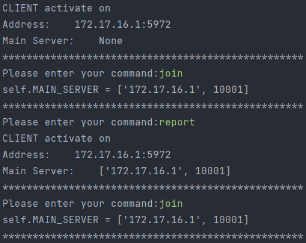

# ds_project_ws2223
Group members: Sena Tarpan, Peter Hoesch, Yun Ye <br>

### Install<br>
Following additional package will be needed:
1. click
2. secrets
### Running<br>
Run the client with a single command:
```
python Client.py
```
In order to start the Server, you need to enter two additional parameters
```
python Server.py --port 10001 --opt 1
```
the parameter `port` identify the port Server connected to. (for UDP) <br>
with `opt` you can define whether the Server is the entry point of this system <br>

The command supported currently:
1. report: get the info of server
2. find: broadcasting
3. exit