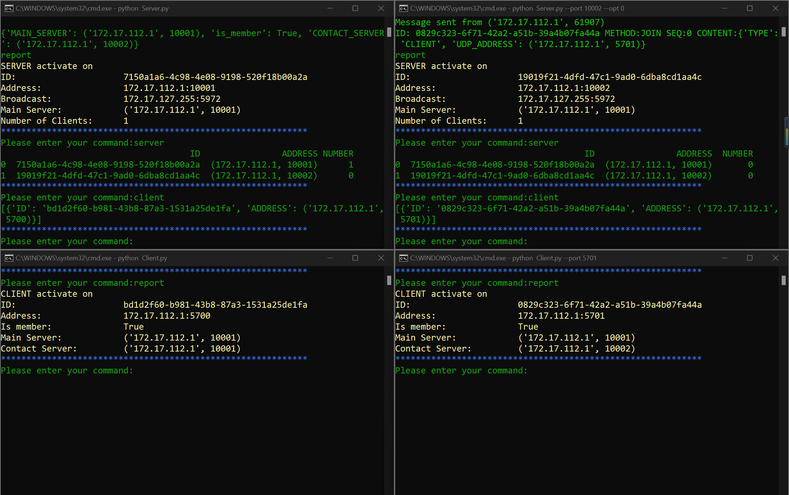

# ds_project_ws2223
👋Group members: Sena Tarpan, Peter Hoesch, Yun Ye <br>

### Introduction
<br>
Our goal in this project is to build a fully functioning, distributed system for Auction.The system will be implemented as a many servers-many clients design. The servers are the seller who functions as the main server as well as supplemental servers that provide fault tolerance and scalability. The clients on the other hand works like a thin client machine that provide merely an interface with a very restricted logic and data functionality. The supplemental servers exist to take bids, aggregate them and transfer that data to the main server. For this purpose, each server will be connected to a number of clients. The clients only communicate with this server, not directly with the main server or with each other. Bids will be placed by using TCP connections from a client to a server to ensure that the bid will be reliably transported.
### Requirements<br>
Following additional package will be needed:
1. click
2. uuid
3. pickle
4. pandas
5. heapq
6. tqdm
7. threading<br>

For the Windows user: It may be a problem with `curses` package.
```
pip install windows-curses
```
### Running<br>
Run the client with a single command:
```
cd Code
python Client.py --port 5700
```
the default port will be 5700, if there are multiple clients, you should manually change the port. <b>Attention: because a single process will use 4 ports, make sure that leave some space between two processes.</b><br>
In order to start the Server, you need to enter two additional parameters
```
cd Code
python Server.py --port 10001 --opt 1
```
the parameter `port` identify the port Server connected to. (for UDP) <br>
with `opt` you can define whether the Server is the entry point of this system. The default setting in this case will be `port 10001` and `opt 1` <br><br>
<b>For windows Users:</b> In the Code dir you can find a `start_win.bat` file, by clicking on it or using the following command in cmd you'll get 4 terminal windows with 2 servers and 2 clients running. It is useful for do some testing. It includes some common cases, for example 2-client-2-server situation and so on.
```
cd Code/start_up
2_client_2_server.bat
```
<b>The command supported currently:</b>
 <br>
1. report: get the info of server
2. find: broadcasting and turn on udp listening after that
3. server: (server only feature) print the servers group list
4. client: (server only feature) print the clients group list
5. leave: clear the memory, ps: for main server is to cancel the priority.
6. clear: clear screen to make the terminal more clean.
7. queue: To show the elements in the hold-back-queue.
8. multi1 & multi2: for the multicast testing. <b>multi1</b> will send out 4 messages with sequence number 1 to 4 with 10 seconds latency before the second message. <b>multi2</b> will send out a single udp message with sequence number 5. In the test, the multi1 should be executed on one server and right after that multi2 on another.
9. history: To check the bit history.
10. intercept: Blocking the next incoming request with sequence number greater than 0.
11. bit: (client only feature) to raise the bit in format `bit <Price>`.
12. ~~join: send request to the main server to join the group~~
13. ~~udp_listen: accept request at the udp port~~
14. ~~rmi: use the format `rmi <port> <methode>` to do remote methode invocation!~~
15. exit
Look in the programm for more details!<br>

### Progressing<br>
 <br>
<b>27.11.2022:</b> tune the broadcast function. Gonna watch the Worldcup! 😊<br>
<b>28.11.2022:</b> multithread tested and added so that the system can handle multi-request.<br>
<b>03.12.2022:</b> realizing the multithread function. Now the model can automatically set up the udp_listen function. Optimize the structure of codes. New abstract function for auction component:`interface()`, `state_update()`
and some small gadgets. Broadcast logic finished! unused user function deleted! Now we have a fully functioning broadcast system!<br>
<b>04.12.2022:</b> Tiny bugs fixed. Now the clients can also use the `find` method to join a group via redirect. Implemented remote methode invocation with no returned value.<br>
<b>05.12.2022:</b> Dealt with the redundant request problem and optimize the structure. New function `assign()` to separate the main server logic with the servers. Finally! rmi works! Now the broadcast function is over and go into Bug test!<br>
<b>06.12.2022:</b> Make the terminal more beautiful<br>
<b>08.12.2022:</b> Add three new port for every process to handle specified task. Use pickle marshall instead of json to send out pandas file. Changed secrets to uuid4.<br>
<b>10.12.2022:</b> add new sequencer. preparation for totally ordered multicast.<br>
<b>11.12.2022:</b> Try broadcast on several physical machines and fixed the ip problem in WLAN situation. Deleted the message class merged it into Auction_component. Use `heapq` to maintain a min-Heap for the hold_back_queue implementation.<br> 
<b>13.12.2022:</b> First test on reliable multicast without negative acknowledgement. No time to do more because of worldcup!<br>
<b>14.12.2022:</b> Negative acknowledgement realized. Add a new user function `intercept`, but not tested. I think I can run the whole test on weekend. Worldcup tonight! <br>
<b>15.12.2022:</b> New component group_member_service(gms) to manage all the client/server list and heartbeat for both client and server. Going to Christmas markt tonight!<br>
<b>16.12.2022:</b> Finally the gms start to functioning! Tones of bugs fixed! New Added `utils.py` and `config.py` to make the code more clean and readable. Removed the code `message.py`, since the function is no longer needed.<br>
<b>17.12.2022:</b> Bit function online! Totally reliable multicast online! but not tested for message loss yet. And btw, i betrayed colorama, because i found rich more beautiful!<br>
<b>19.12.2022:</b> Add a batch file for testing. Fixed color issue caused by multi-threading.<br>
<b>21.12.2022:</b> New headless model and function_test.py. For the future experiment and testing. New global_time_sync.py module to synchronize the clock in the best effort (planning phase).
<b>24.12.2022:</b> New TUI developing... And merry christmas!!!<br>
<b>12.01.2023:</b> Fixed little bugs for broadcast in complex environment and bit function correction.<br>
<b>13.01.2023:</b> Added election functions! Start to look better!
<b>14.01.2023:</b> Fixed bugs in election and broadcasts. The subnet mask now is functioning on windows, test still need on linux pc.<br>
<b>15.01.2023:</b> Supplementary coding for gms and gts. Tested reliable ordered  multicast. Various bugs fixed.<br>
<b>16.01.2023:</b> merge some of the functions. Try to implement byzantine agreement part. Add return value function for the remote method invocation and add new multicast send wit response messages.<br>
 <br>
<b>18.01.2023:</b> I am soooo stupid.😡 Until today's lecture i realized that the multicast that I've used is group_unicast. So, I corrected it. Now we have the right one. And updated the RMI methode to and add some comments.<br>
<b>23.01.2023:</b> Refine election code. Move all the MAIN_SERVER part into the gms to separate the usages. Debugging. Tested multi failure possibilities and enable some degrees of failure management.<br>
<b>24.01.2023:</b> first time test on 4-server 4-client(and 4-server 8 client) situation and multiple machine. Not very good. Deliver a few bugs and did some code optimizations.<br> 
<b>25.01.2023:</b> dealt with the problem that the sequence synchronize problem for later joined processes.<br> 
<b>27.01.2023:</b> multiple bugs fixed! Tested on 12 Process in multiple physical devices and it worked like a charm! <br> 
### TODO<br>
1. election failure model
2. bugs fix!!!!!!!!
3. ~~BIG PROBLEM: I don't know how to add emoji in markdown!!~~